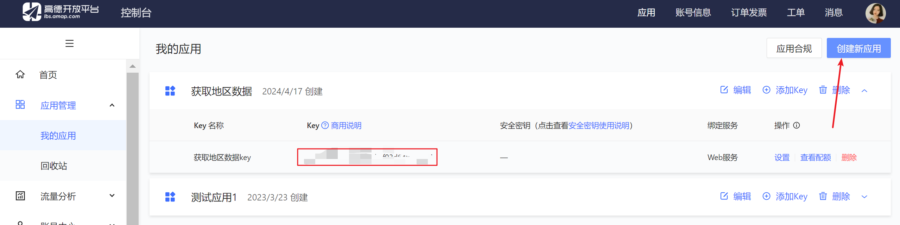

# District-SQL
通过高德数据获取国内的地区信息

鉴于[2020年最新省、市、区县、街道乡镇四级数据](https://blog.csdn.net/qq_37328871/article/details/111591500)没有地区街道（四级）的数据
因此我鉴于他的进行的改进

## 登录高德开发者平台官网 创建一个web应用的key
https://console.amap.com/dev/key/app

## 调用高德接口
https://lbs.amap.com/api/webservice/guide/api/district

## 处理数据，插入数据库表
具体代码看：[DistrictTestController.java](src%2Fmain%2Fjava%2Fcom%2Fexample%2Fdistrictsql%2FDistrictTestController.java)

已经处理好的数据看（深度优先遍历结果）：[sys_district.sql](sys_district.sql)
已经处理好的数据看（广度优先遍历结果）：[sys_district2.sql](sys_district2.sql)

